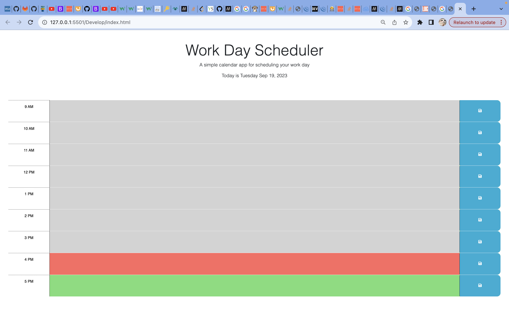

# Work Day Scheduler

Starter code was provided for this project; the purpose is to create a 9am-5pm workday scheduler that could mark hours past, hours future and the present hour as well as save user data using local storage to display user input daily tasks on the webpage.

## Installation

N/A Webpage is viewable online

## Usage
This is the webpage displayed at full screen, my time is currenly 4 pm; the greyed out areas indicate hours that have already passed, the red highlight indicates that it is present hour, and green highlights indicate all future hours. 
    ```md
    

You can input a task into the Present hour textarea on the webpage  
    ```md
    

Selecting the save icon to the right side of the text will save it to the page;
    ```md
    

If we open the console, we can see that saving the text input also console logs what the user input. 
    ```md
    

Additionally, we can add more tasks into the future hour textarea of our planners. 
    ```md
    

You can also save task values input for the future hours as well
    ```md
    

You can also add tasks to hours that have passed in the day in case you forgot to write it down. 
    ```md
    

Saving task value for past task input
    ```md
    

Past present and future task values will remain on the webpage even if you reload it!!
    ```md
    

The webpage is also mobile compatible!
    ```md
    


## License

[MIT](https://choosealicense.com/licenses/mit/)

    ```

## Credit
Readme.md Guide(https://coding-boot-camp.github.io/full-stack/github/professional-readme-guide)
CSS Tutorials (https://www.w3schools.com/)
Tutor: Wen-jui Cheng!


## How to Contribute

If you created an application or package and would like other developers to contribute it, you can include guidelines for how to do so. The [Contributor Covenant](https://www.contributor-covenant.org/) is an industry standard, but you can always write your own if you'd prefer.

